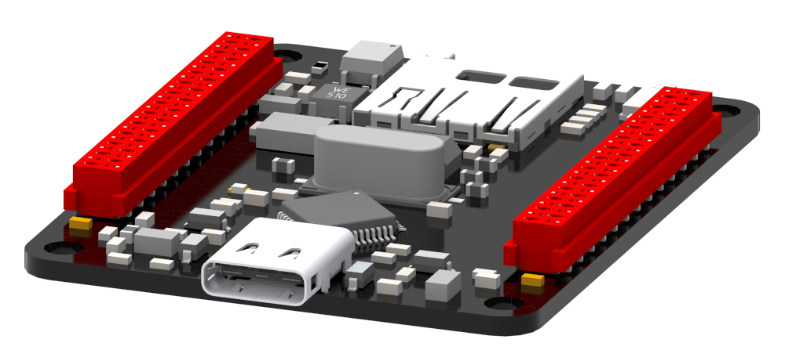
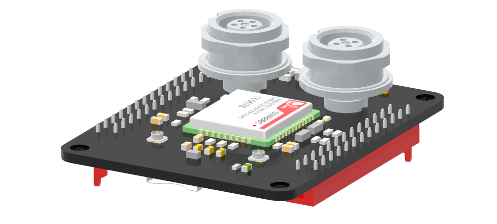
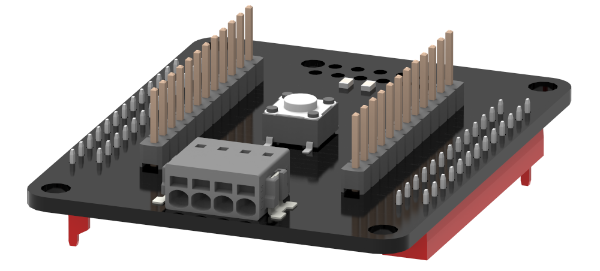
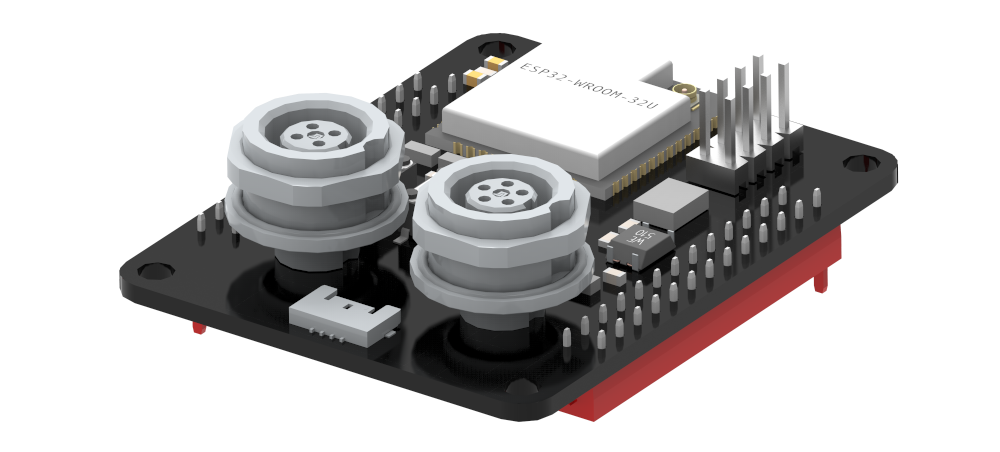

<div align="center">
  
  <br />
  <br />

  **a dev board to end all dev boards**
</div>


# Project board::mini
the **bmc::board** project consits of a microcontroller board based upon the
STM32f103 which is a development board with many auxiliary features like a CAN
transciever with hardware filter and ESD protection, a micro SDcard slot, 12V
power supply, an atmospheric conditions sensor, USB-C and much more.

the **mini::base** can be stacked with either the mini::out, the mini::grid or
the mini::pit, to enable further features like wifi or GPS.


# Repo Structure
board::mini consists of a **mini::base** and can easily be upgraded with either
- a mini::grid,
- a mini::out,
- a mini::pit,

the repo is structured by the main folder, which contains this README.md and a
subdirectory for each board with the following tree:
```
.
├── mini_<board>
│   ├── arduino_examples
│   ├── design_files
│   ├── pictures
│   ├── production_files
│   └── README.md
```
follow the instructions in our [Getting
Started](./mini_base/getting_started.md) section, to get the project rolling.

## mini::base


our focus for the **mini::base** were practical, commonly used features
implemented via reliable components. we aim to make the bmc::board line viable
for everything from development through prototyping and final product.


the **mini::base** comes with
    - industrial grade board-to-board connectors by Würth
    - ambient conditions sensor by NXP
    - high quality micro SD Card slot by Würth
    - CAN transceiver by Texas Instruments
    - software switchable CAN terminating resistor
    - USB Type C connector by Würth
    - 9 to 24V power supply (3.3V and 5V can be used as well)

## mini:grid


with the **mini::grid**, we aimed to create a versatile extension to the
mini::base for edge applications. it therefore has connector footprints for THT
loom connectors which wire the power supply, CAN and some I/Os, it has a
connector for a small display and it has connectors for external GSM/GPRS and
GPS antennae. all connectors are industrial grade.


the **mini::grid** comes with
    - loom connectors (by Binder, 4p and 5p)
    - display connector by molex
    - antennae connectors by Hirose
    - Nano SIM connector by Würth

## mini::out


the **mini::out** has the same basic dimensions as the mini::base and all other
mini series extension boards. the bolt holes are made for M3 bolts. and there
is another feature on the mini series: the Würth board-to-board connectors are
stable enough for any combination of mini::base plus extension board to be
fixed in a housing by simply sandwiching the boards package between two housing
halves.


the **mini::out** comes with
    - access to CAN and all native pins
    - reset button for ease of development
    - JTAG connector footprint for use with the out::cable

## mini::pit


with the **mini::pit**, we aimed to create a versatile extension to the
mini::base for local wireless applications. in terms of the wired interface,
  there are two footprints for THT loom connectors which wire the power supply
  and one CAN on one and some I/Os and the other CAN on the other, it has a
  connector for a small display and it has a connector for an external BLE /
  WiFi antenna.


the **mini::pit** comes with
    - loom connectors (by Binder, 4p and 5p)
    - display connector by molex
    - CAN identical config as on the mini::base

---

<div align="center">
<a rel="license" href="http://creativecommons.org/licenses/by-sa/4.0/">
  
</a>
<br />
This work is licensed under a
<a rel="license" href="http://creativecommons.org/licenses/by-sa/4.0/">
  Creative Commons Attribution-ShareAlike 4.0 International License
</a>
</div>
