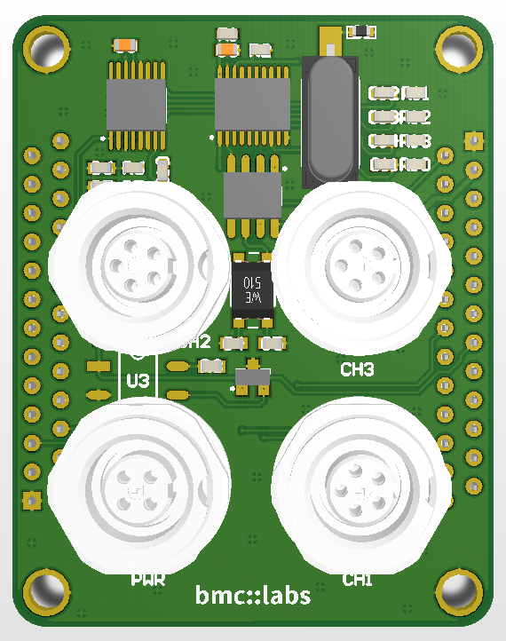

# Datasheet
The **mini::lab** is based around a 12 bit, 8 channel analog to digital converter (ADC128S102) from Texas Instruments and 
a MCP2515 CAN bus IC with transceiver to add a second CAn channel. Connect it to
your custom application via the four Binder subminiatur connectors with wire out
CAN, power supply and IOs.

## Microcontroller
 * ADC
    * Manufacturer: Texas Instruments
    * Type: ADC128S102
 * CAN
    * Manufacturer: Microchip
    * Type: MCP2515

## Key Features
The ADC128S102 is a low-power, eight-channel
CMOS 12-bit analog-to-digital converter specified for
conversion throughput rates of 500 ksps to 1 MSPS.
The converter is based on a successive-approximation register 
architecture with an internal /MICROWIRE™/DSP Compatible
track-and-hold circuit. It can be configured to accept
up to eight input signals at inputs IN0 through IN7.

The MCP2515 is a second generation stand-alone CAN controller. 
It is pin and function compatible with the MCP2510 and also includes 
upgraded features like faster throughput, databyte filtering, 
and support for time-triggered protocols.

## Board

* Size: 54mm x 42.5 mm - exactly half a credit card
* Mounting Holes:
 * ø 3.2mm (for M3 bolt)
 * spaced 48mm and 36.5mm from each other
* Board-to-Board Connectors:
 * 2x Würth WR-MM Male 26p, 690357102672
 * pinout symmetrical - top boards can be rotated
* Auxilary Conectors
 * 1x 4-Pin BINDER (PWR) for Power Supply and CAN
 * 3x 5-Pin BINDER (CH1-CH3) for digital and analog Sensor Input, 5V Sensorsupply

## License

