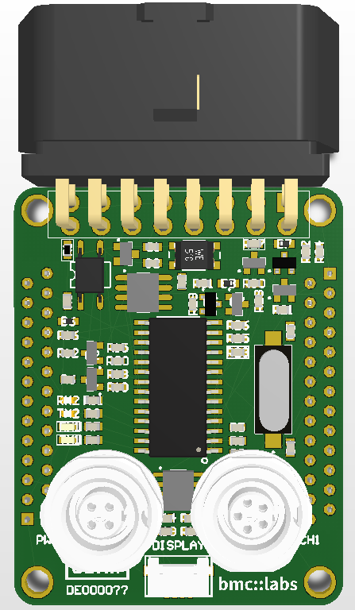

# Datasheet
The **mini::obd** is based around the ELM327 OBD to RS232 Interpreter, 
featuring ISO 15765-4 CAN, SAE J1850 and ISO 9141-2 and ISO 14230-4 K-Line (KWP2000). Connect it to
your custom application via the two Binder subminiatur connectors with wire out
CAN, power supply and IOs.

## Microcontroller
 * Manufacturer: ELM Electronics
 * Type: ELM327

## Key Features
Almost all of the automobiles produced today are required, by law, to provide an interface for the connection of diagnostic test equipment. The data transfer on these interfaces follow several standards, but none of them are directly usable by PCs or smart devices. The ELM327 is designed to act as a bridge between these On-Board Diagnostics (OBD) ports and a standard serial interface.

In addition to being able to automatically detect and interpret nine OBD protocols, the ELM327 also provides support for high speed communications, a low power sleep mode, and the J1939 truck and bus standard. It is also completely customizable, should you wish to alter it to more closely suit your needs.

The data sheet discusses all of the ELM327’s features in detail, how to use it and configure it, as well as providing some background information on the protocols that are supported. There are also schematic diagrams and tips to help you to interface to microprocessors, construct a basic scan tool, and to use the low power mode.

If you are wondering what the differences are between the many ELM327 versions, you may find the Version History section in Help / OBD / Tips to be helpful.

## Board

* Size: 54mm x 42.5 mm - exactly half a credit card
* Mounting Holes:
 * ø 3.2mm (for M3 bolt)
 * spaced 48mm and 36.5mm from each other
* Board-to-Board Connectors:
 * 2x Würth WR-MM Male 26p, 690357102672
 * pinout symmetrical - top boards can be rotated
* Auxilary Conectors
 * 1x 4-Pin BINDER (PWR) for Power Supply and CAN
 * 1x 5-Pin BINDER (CH1) for digital and analog Sensor Input, 5V Sensorsupply
 * 1x 16-Pin trapezoid OBD2 connector 

## License

