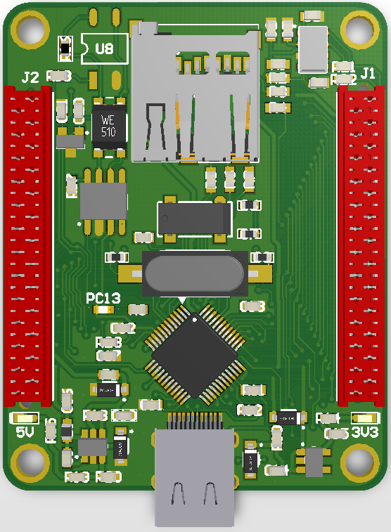
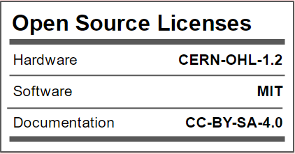

# Datasheet
## Microcontroller
* Manufacturer: ST
* Architecture: ARM®32-bit Cortex®-M3 CPU Core
* Type: STM32F103CBT6
## Key Features 
* ARM®32-bit Cortex®-M3 CPU Core
  * 72 MHz maximum frequency,1.25 DMIPS/MHz (Dhrystone 2.1) performance at 0 wait state memory access
  * Single-cycle multiplication and hardware division
* Memories
  * 64 or 128 Kbytes of Flash memory
  * 20 Kbytes of SRAM
* Clock, reset and supply management
  * 2.0 to 3.6 V application supply and I/Os
  * POR, PDR, and programmable voltage detector (PVD)
  * 4-to-16 MHz crystal oscillator
  * Internal 8 MHz factory-trimmed RC
  * Internal 40 kHz RC
  * PLL for CPU clock
  * 32 kHz oscillator for RTC with calibration
* Low-power
  * Sleep, Stop and Standby modes
  * VBAT supply for RTC and backup registers
* 2 x 12-bit, 1 μs A/D converters (up to 16 channels)
  * Conversion range: 0 to 3.6 V
  * Dual-sample and hold capability
  * Temperature sensor
* DMA
  * 7-channel DMA controller
  * Peripherals supported: timers, ADC, SPIs, I2Cs and USARTs
* Up to 80 fast I/O ports
  * 26/37/51/80 I/Os, all mappable on 16 external interrupt vectors and almost all 5 V-tolerant
* Debug mode
  * Serial wire debug (SWD) & JTAG interfaces
* 7 timers
  * Three 16-bit timers, each with up to 4 IC/OC/PWM or pulse counter and quadrature (incremental) encoder input
  * 16-bit, motor control PWM timer with dead-time generation and emergency stop
  * 2 watchdog timers (Independent and Window)
  * SysTick timer 24-bit downcounter
* Up to 9 communication interfaces
  * Up to 2 x I2C interfaces (SMBus/PMBus)
  * Up to 3 USARTs (ISO 7816 interface, LIN, IrDA capability, modem control)
  * Up to 2 SPIs (18 Mbit/s)
  * CAN interface (2.0B Active)
* USB 2.0 full-speed interface
* CRC calculation unit, 96-bit unique ID
* Packages are ECOPACK®

## Board

* Size: 54mm x 42.5 mm - exactly half a credit card
* Mounting Holes:
  * ø 3.2mm (for M3 bolt)
  * spaced 48mm and  36.5mm from each other
* Voltage transformer for external power:
  * up to 24V input
  * up to 1.2A @ 5V output
  * up to 1A @ 3,3V output
* Board-to-Board Connectors:
  * 2x Würth WR-MM Female 26p, 690367182672
  * pinout symmetrical - top boards can be rotated
* USB Type C connector
  * JAE DX07S016JA1R1500
* micro SD Card slot 
* CAN connection available on board-to-board connector pins 5 and 6
  * transceiver equipped: SN65HVD230
  * terminating resistor equipped, switchable in software
* pressure, altitude and temperature combined sensor
  * sensor equipped: MPL3115A2
  * quality suitable for environmental measurements: barometric pressure, etc
## pinout

## programm settings
* board: generic STM32F103C series
* variant: STM32F103CB (20k RAM, 128k flash)
* upload method: STM32duino bootloader
* CPU speed: 72 MHz 
* optimize: smallest(default)
## internal IOs
* CAN
  * CAN TX - PB9
  * CAN RX - PB8
  * CAN termination - PA0 (high=on)
* SD card
  * CS - PA4
  * MISO - PA6
  * MOSI - PA7
  * SCK - PA5
* temp. sensor
  * SCL - PB6
  * SDA - PB7
* user led
  * led - PC13 (low=on)
  
## License

