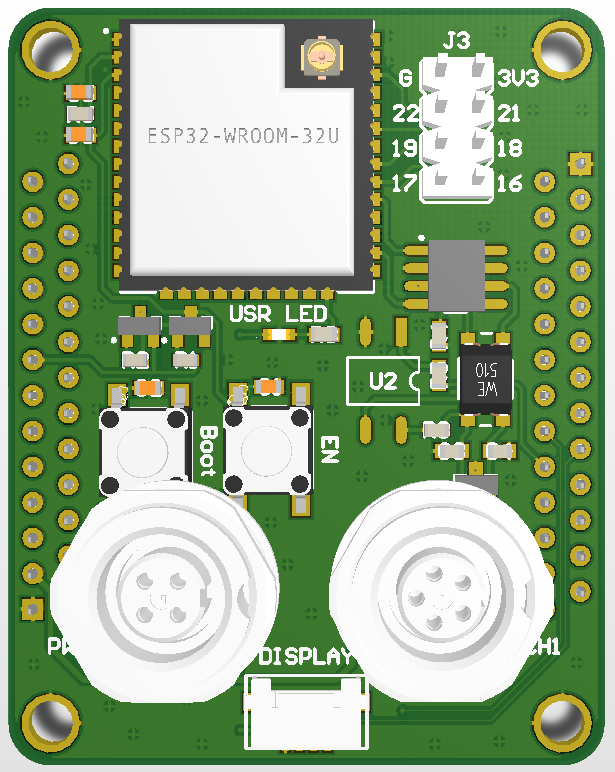
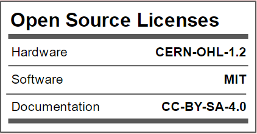

# Datasheet
## Microcontroller
 * Manufacturer: Espressif Systems
 * Architecture: ESP8266
 * Type: ESP32-WROOM-32-U
## Key Features 
The ESP8266 WROOM series includes the ESP-WROOM-02(D/U) and ESP-WROOM-S2 modules.
ESP-WROOM-02(D/U) is a low-power 32-bit MCU Wi-Fi module, based on the ESP8266 chip. TCP/IP network stacks, 10-bit ADC, and HSPI/UART/PWM/I2C/I2S interfaces are all embedded in this module.
ESP-WROOM-S2 uses a 2 MB SPI flash connected to HSPI, working as SDIO/SPI slave, with the SPI speed being up to 8 Mbps.

 * Certified by Wi-Fi Alliance, SRRC, FCC, CE ( RED ), TELEC, IC & KCC 
 * Compliant with RoHS, REACH & CFSI 
 * HTOL, ESD-HM, MSL, μHAST, HTSL
 * Output Power: +22dBm peak power in the FCC certification

The ESP8266 Module can be easily integrated into space-constrained devices, due to its small size of only 18mm x 20mm (ESP-WROOM-02) / 16 mm x 23 mm (ESP-WROOM-S2). 

The ESP8266 module can operate in a low-power connectivity mode. For instance, if it operates in DTIM10, it consumes only 1.2mW while maintaining a Wi-Fi connection. The module also integrates an SPI flash of 16 Mbits used for storing user programs, data and firmware.
## Board 

 * Size: 54mm x 42.5 mm - exactly half a credit card
 * Mounting Holes:
   * ø 3.2mm (for M3 bolt)
   * spaced 48mm and  36.5mm from each other
 * Board-to-Board Connectors:
   * 2x Würth WR-MM Male 26p, 690357102672
   * pinout symmetrical - top boards can be rotated
 * Auxilary Conectors
   * 1x 4-Pin BINDER (PWR) for Power Supply and CAN
   * 1x 5-Pin BINDER (CH1) for digital IO, CAN and 5V Sensorsupply
 * additional CAN, accesible vie the ESP32-WROOM-32-U
## programm settings
 * board: ESP32 dev module
 * upload speed: 115200
 * CPU frequency: 240MHz (wifi/bt)
 * flash frequency: 40MHz
 * flash mode: DIO
 * flash size: 4MB(32Mb)
 * partition scheme: default 4MB with spiffs
 * PSRAM: disabled
## programm mode
 * click on "upload" in the Arduino IDE
 * push "Boot" and keep pushed
 * shortly push "EN"
 * when Arduino IDE says: "upload complete", release "Boot"
 * push "EN" to reset the board to run mode
## License

